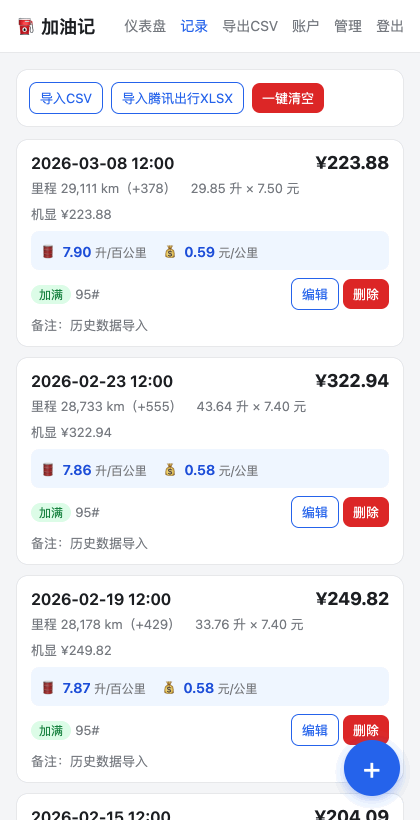

# 加油记

加油记是一个面向个人车主的轻量油耗记录网站，适合在加油现场用手机快速录入数据，并在云端保存、统计和导出。项目使用 TypeScript、Hono、Cloudflare Workers、D1 和 R2，前端为原生 HTML/CSS/JavaScript，图表使用 Chart.js。

## 功能特性

### 安全登录

登录需要先通过图形验证码（服务端生成的扭曲矢量图形，答案不出现在页面源码中），再校验用户名密码，最后进入两步验证：输入认证器上的 6 位 TOTP 验证码或一次性备用恢复码。普通用户可在账户页自助开启或关闭两步验证，管理员账号则强制启用。会话存储在 D1 中，便于登出和主动吊销；登录接口带 IP 限速，防止暴力破解。


### 截图识别快速记录

录入页面向手机场景优化：上传加油截图后在浏览器本地完成 OCR 识别，自动回填日期、时间、油价、加油量、金额、油品和加油站，并以高亮提示所有自动填充的字段，识别所用的截图会自动保存为该记录的附件。OCR 完全在本地浏览器中进行，截图不会上传到任何云端识别服务，最大限度保护票据、位置和消费等隐私数据。当前里程由车主手动确认；输入油价与加油量后机器显示金额自动计算，实付金额可单独调整以记录优惠和折扣。


### 仪表盘统计

仪表盘展示平均油耗、最近一箱油耗、每公里油费、累计里程、累计油费、累计加油量、平均油价、今年里程和今年油费，并提供分段油耗、每公里油费、油价趋势、月度油费、月度里程和年度对比共 6 张趋势图。平均油耗按“两次加满之间的实际补油量”加权计算，避免非加满记录造成误差。


### 记录管理与数据迁移

记录按时间倒序分页展示，每条加满记录直接显示该箱油的分段油耗（升/百公里）和每公里油费，支持编辑与删除，统计即时重算。工具栏提供 CSV 导出、CSV 回导、腾讯出行 XLSX 历史数据迁移和两次确认的一键清空。



### 用户注册与管理后台

支持多用户注册（管理员可随时开关注册入口，默认关闭），各用户数据完全隔离。管理员在后台可以查看全部用户的角色、状态、两步验证情况、最近登录时间与 IP、登录次数以及记录数和附件占用空间，并可停用/启用用户（停用即强制下线）、重置用户两步验证、删除用户及其全部数据。


### 更多能力

- 附件保存：支持为每条记录上传加油票据或截图到 Cloudflare R2，图片内联预览，其余类型按附件下载。
- 腾讯出行迁移：导入时根据“最新油耗”连续重复值推断加满分段，组内最新一条标记为加满，其余标记为未加满，首条新车基线记录也按未加满处理。
- 登录审计：记录每次成功登录的时间、IP 和 User-Agent，供管理后台查询。

## 技术栈

- Runtime: Cloudflare Workers
- Backend: TypeScript + Hono
- Database: Cloudflare D1
- Object Storage: Cloudflare R2
- Frontend: HTML + CSS + JavaScript
- Charts: Chart.js CDN

## 本地开发

```bash
npm install
npm run db:init:local

# 生成初始化用户 SQL。随机密码会输出到终端，SQL 文件只包含密码哈希。
node scripts/create-user.mjs <username> > user.sql
npx wrangler d1 execute fuellog --local --file=user.sql
rm user.sql

npm run dev
```

本地服务默认运行在 `http://localhost:8787`。

## Cloudflare 部署

详细的新环境部署、D1/R2 初始化、自定义域名和后续更新流程见：[Cloudflare Workers 部署操作指南](docs/cloudflare-worker-deploy-guide.md)。

如果希望主要通过 Cloudflare 网页控制台和 GitHub 网页完成部署，见：[Cloudflare 网页控制台部署指南](docs/cloudflare-dashboard-deploy-guide.md)。

1. 登录 Cloudflare：

```bash
npx wrangler login
```

2. 创建 D1 数据库，并把输出的 `database_id` 填入 `wrangler.jsonc`：

```bash
npx wrangler d1 create fuellog
```

3. 创建 R2 存储桶。如果使用不同名称，也同步修改 `wrangler.jsonc`：

```bash
npx wrangler r2 bucket create fuellog-attachments
```

4. 初始化远程数据库：

```bash
npm run db:init:remote
```

如果是从旧版本升级已有远程数据库，先执行一次账号与管理后台迁移：

```bash
npx wrangler d1 execute fuellog --remote --file=migrations/0001_accounts_admin.sql
```

5. 创建远程管理员：

```bash
node scripts/create-user.mjs <username> > user.sql
npx wrangler d1 execute fuellog --remote --file=user.sql
rm user.sql
```

6. 部署：

```bash
npm run deploy
```

部署后访问 `https://fuellog.<your-subdomain>.workers.dev`。

## 配置说明

`wrangler.jsonc` 中的 `database_id` 已使用占位值，首次部署前必须替换为你自己的 D1 数据库 ID。仓库不应提交 `.dev.vars`、`.env*`、`user.sql`、`.wrangler/`、`node_modules/` 或任何包含密码、令牌、Cookie、会话、恢复码的文件。

## 项目结构

```text
src/index.ts              Hono Worker 入口：认证、记录 CRUD、附件、统计、CSV 导出
src/auth.ts               PBKDF2 密码哈希、会话 token、TOTP、备用恢复码
src/stats.ts              油耗与费用统计算法
public/                   前端页面与静态资源
public/assets/ocr.js      截图 OCR 解析辅助
schema.sql                D1 表结构
migrations/               既有 D1 数据库升级脚本
scripts/create-user.mjs   生成初始化用户 SQL
wrangler.jsonc            Cloudflare Workers、D1、R2 配置
```

## 安全提示

- 初始化用户脚本不会把明文密码写入 SQL 文件；随机密码只显示在终端，请立即保存。
- 两步验证绑定后，备用恢复码只显示一次；每个恢复码只能使用一次。
- 附件接口需要登录后访问，图片以内联方式预览，非图片按附件下载。
