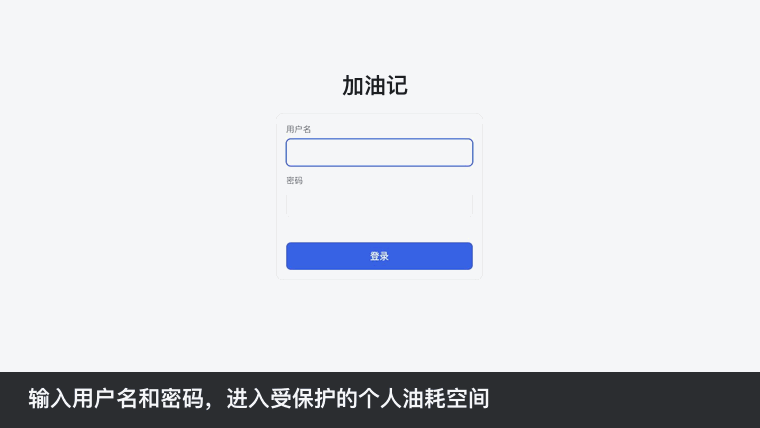
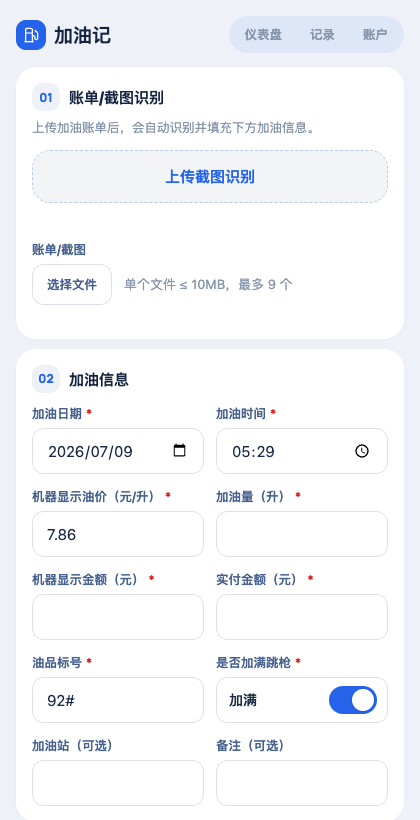
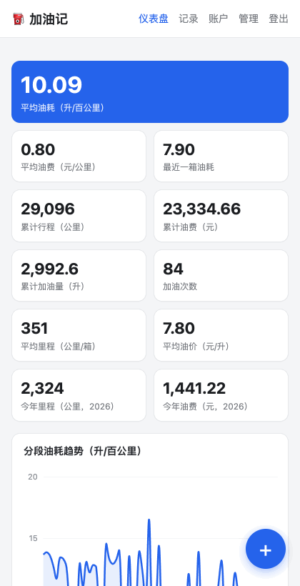

# 加油记

加油记是一个面向个人车主的轻量油耗记录网站，适合在加油现场用手机快速录入数据，并在云端保存、统计和导出。项目使用 TypeScript、Hono、Cloudflare Workers、D1 和 R2，前端为原生 HTML/CSS/JavaScript，图表使用 Chart.js。

## 功能特性

### 安全登录

用户名密码登录后进入两步验证流程；首次登录会引导绑定认证器，后续可使用 6 位 TOTP 验证码或一次性备用恢复码登录。会话存储在 D1 中，便于登出和主动吊销。



### 快速记录油耗

录入页面面向手机场景优化，可以上传加油截图并在浏览器端自动识别票据文字，尝试回填日期、时间、油价、加油量、金额、油品和加油站。OCR 识别仅在本地浏览器中进行，不会将截图上传到任何云端识别服务，最大限度保护票据、位置和消费等隐私数据。当前里程由车主手动确认；输入油价与加油量后，机器显示金额会自动计算，实付金额也可以手动调整以记录优惠和折扣。



### 仪表盘统计

仪表盘展示平均油耗、最近一箱油耗、每公里油费、累计里程、累计油费、累计加油量、平均油价、今年里程和今年油费。平均油耗按“两次加满之间的实际补油量”加权计算，避免非加满记录造成误差。



### 更多能力

- 记录管理：按时间倒序分页查看，支持编辑、删除，统计会即时重算。
- 趋势图表：展示分段油耗、每公里油费、油价趋势、月度油费、月度里程和年度对比。
- 附件保存：支持上传加油票据或截图到 Cloudflare R2，并与加油记录关联。
- OCR 辅助：可从加油截图中尝试识别日期、时间、油价、油量、金额、油品和加油站字段，识别后仍需人工核对。
- 数据导出：一键导出 UTF-8 BOM CSV，便于用 Excel 打开和二次分析。

## 技术栈

- Runtime: Cloudflare Workers
- Backend: TypeScript + Hono
- Database: Cloudflare D1
- Object Storage: Cloudflare R2
- Frontend: HTML + CSS + JavaScript
- Charts: Chart.js CDN

## 本地开发

```bash
npm install
npm run db:init:local

# 生成初始化用户 SQL。随机密码会输出到终端，SQL 文件只包含密码哈希。
node scripts/create-user.mjs <username> > user.sql
npx wrangler d1 execute fuellog --local --file=user.sql
rm user.sql

npm run dev
```

本地服务默认运行在 `http://localhost:8787`。

## Cloudflare 部署

1. 登录 Cloudflare：

```bash
npx wrangler login
```

2. 创建 D1 数据库，并把输出的 `database_id` 填入 `wrangler.jsonc`：

```bash
npx wrangler d1 create fuellog
```

3. 创建 R2 存储桶。如果使用不同名称，也同步修改 `wrangler.jsonc`：

```bash
npx wrangler r2 bucket create fuellog-attachments
```

4. 初始化远程数据库：

```bash
npm run db:init:remote
```

5. 创建远程用户：

```bash
node scripts/create-user.mjs <username> > user.sql
npx wrangler d1 execute fuellog --remote --file=user.sql
rm user.sql
```

6. 部署：

```bash
npm run deploy
```

部署后访问 `https://fuellog.<your-subdomain>.workers.dev`。

## 配置说明

`wrangler.jsonc` 中的 `database_id` 已使用占位值，首次部署前必须替换为你自己的 D1 数据库 ID。仓库不应提交 `.dev.vars`、`.env*`、`user.sql`、`.wrangler/`、`node_modules/` 或任何包含密码、令牌、Cookie、会话、恢复码的文件。

## 项目结构

```text
src/index.ts              Hono Worker 入口：认证、记录 CRUD、附件、统计、CSV 导出
src/auth.ts               PBKDF2 密码哈希、会话 token、TOTP、备用恢复码
src/stats.ts              油耗与费用统计算法
public/                   前端页面与静态资源
public/assets/ocr.js      截图 OCR 解析辅助
schema.sql                D1 表结构
scripts/create-user.mjs   生成初始化用户 SQL
wrangler.jsonc            Cloudflare Workers、D1、R2 配置
```

## 安全提示

- 初始化用户脚本不会把明文密码写入 SQL 文件；随机密码只显示在终端，请立即保存。
- 两步验证绑定后，备用恢复码只显示一次；每个恢复码只能使用一次。
- 附件接口需要登录后访问，图片以内联方式预览，非图片按附件下载。
